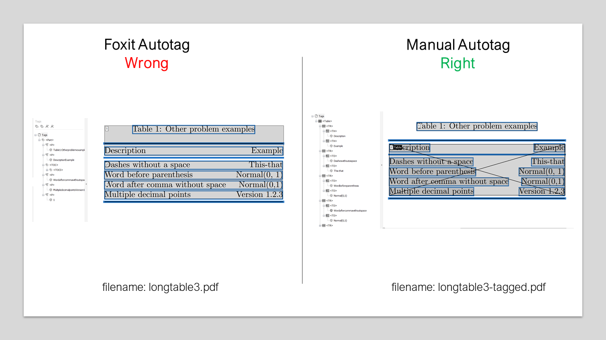

# Minimal examples of issues with TeX table tagging

## Context

The Canadian Science Advisory Secretariat (CSAS) is the authoritative body that
coordinates the national scientific peer-review and science advice process for
Fisheries and Oceans Canada (DFO). Advice might relate to the state of an
ecosystem, the impacts of a human activity, the effectiveness of a mitigation
strategy, and many other areas under DFO's mandate.

## csasdown R package

DFO scientists developed an R package for creating CSAS reports with R Markdown
and bookdown: [csasdown](https://github.com/pbs-assess/csasdown). We are
championing the use of this package by developing training and showcasing
testimonials to demonstrate how LaTeX, R, Markdown and reproducible tools can
help improve the efficiency and quality of the work that we do.

## The accessibility challenge

Accessibility tags are a requirement of the Government of Canada. The main
hurdle towards achieving a wider adoption of csasdown is enabling tagged
content in PDF from LaTeX. Tagging tables takes the most time, particularly for
documents that have many or long/complex tables (e.g., contain elements like
equations). Currently, a manual process is required to highlight and create
tags/containers in a specific order for many tables, which can be very
time-consuming (past documents have ranged from between four hours to 35 hours
for full completion of web accessibility for one document). To alleviate some
of the burden associated with tagging tables, a series of
[tips that may improve table tagging](https://github.com/pbs-assess/csasdown/wiki/Table-tagging-for-the-PDF)
in the Adobe software were developed; however, authors have had mixed success
applying these tips. Limiting the number of tables in documents rendered with
csasdown has been recommended to avoid many potential hours of manual work.
Also, a tutorial of how to do the manual tagging of tables to fulfill
accessibility tags is available here:
[Accessibility tags for CSAS documents rendered with csasdown](https://www.youtube.com/watch?v=lJYOu2He0Wo)

## Simple LaTeX example

This repo contains minimal `.tex` files with simple tables representing our
most common issues. The screenshots below represent the most basic tables
possible, which have issues with the auto-tagging process in [Foxit](https://www.foxit.com/pdf-reader/).

- Left panels showcase tables incorrectly auto-tagged with Foxit: labels are
  not assigned properly and values are not stored in individual containers.

- Right panels showcase tables properly tagged manually (auto-tagging of the
  full document is applied first): labels are applied correctly, heading tags are
  properly assigned, each value of the table is stored in individual containers,
  tags were manually assigned to be read in the correct order.

